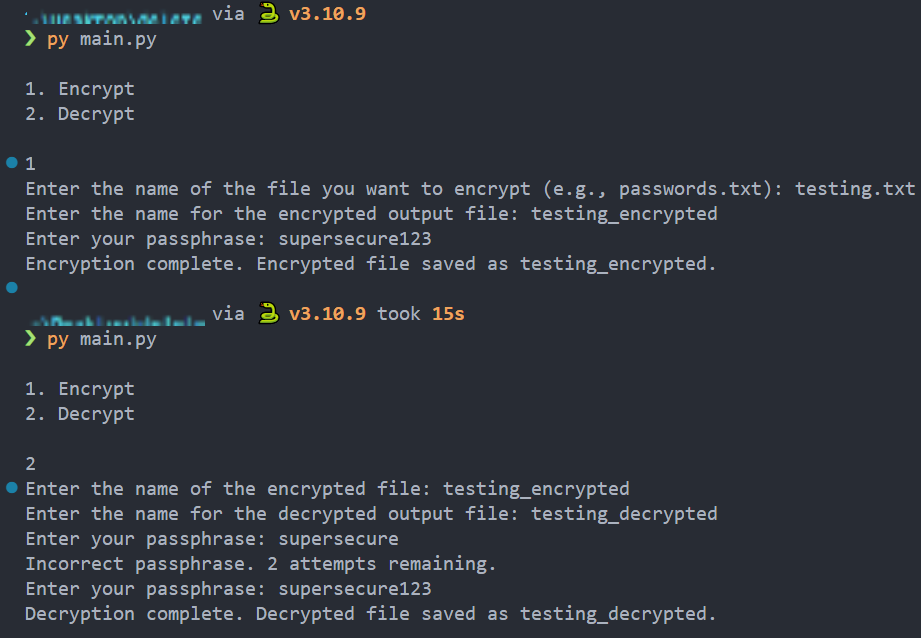

# TamperPY

TamperPY is a security layer for Python scripts and general files, ensuring their integrity and providing tamper resistance. While it's primary feature is to encrypt files and ensure no tampering is happening, the tool is built with flexibility in mind, allowing for future expansion of security features.

# Features:
<li>File Integrity Check: Ensures that the main.py script hasn't been tampered with, using SHA-256 hashing.</li>
<li>Auto-detection of Operating System: Automatically creates the relevant script (check_integrity.bat for Windows or check_integrity.sh for Linux/Unix) based on the detected OS.</li>
<li>Tamper Response: Deletes the file or takes other security actions if tampering is detected.</li>

# Setup
$ git clone https://github.com/Insula415/TamperPY.git  
$ pip install pycryptodome
$ python3 setup.py

